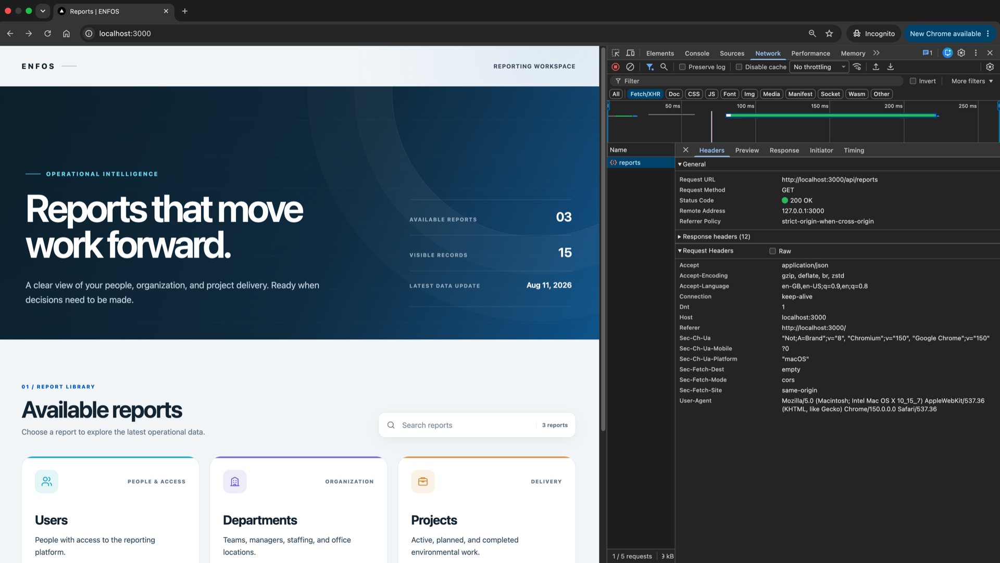
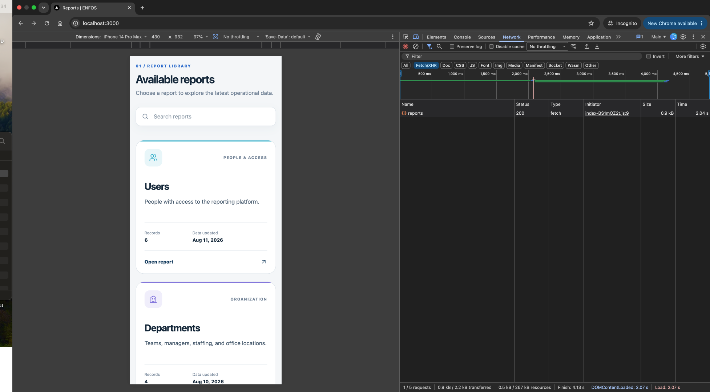
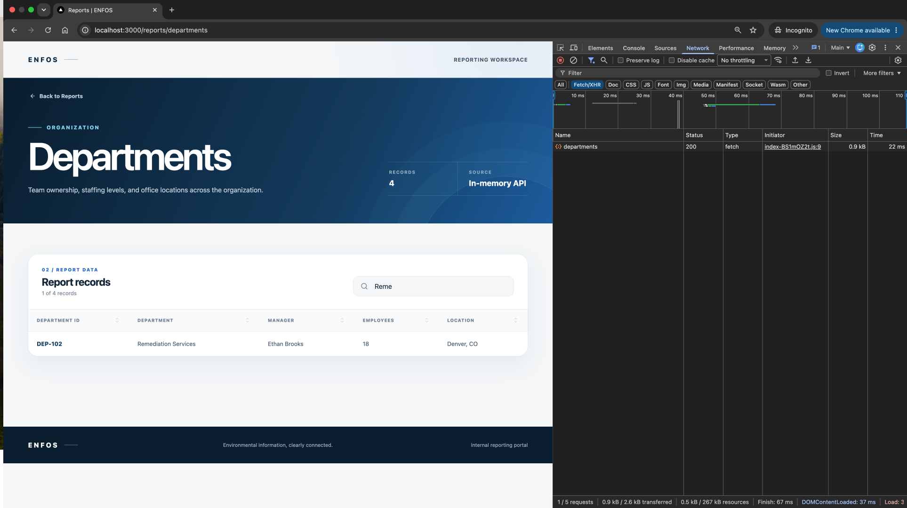
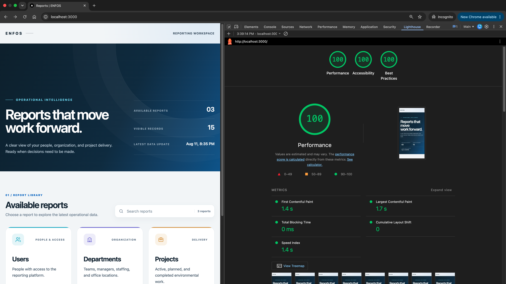

# ENFOS Reporting Portal

[](https://github.com/KarthikSunkari/enfos-reporting-portal/actions/workflows/ci.yml)

A production-minded full-stack reporting portal built with React, TypeScript, Java, and Spring Boot. Users can discover available reports, search the report catalog, and explore Users, Departments, and Projects data in responsive tables.

The application uses deterministic in-memory data so it can be reviewed without database setup. Docker Compose builds, verifies, and starts the complete stack with one command.

## Features

- Searchable report landing page with descriptions, record counts, and dataset update timestamps
- Dedicated Users, Departments, and Projects report routes
- Responsive semantic tables with search and accessible column sorting
- Loading skeletons, empty states, no-result states, error recovery, and unknown-route handling
- Runtime validation of API payloads before data reaches the UI
- Request cancellation and a 10-second client timeout
- Keyboard-visible focus, semantic landmarks, live result counts, and reduced-motion support
- Health-checked, non-root containers with bounded logs and graceful shutdown
- Same-origin production proxy with restrictive browser security headers

## Technology

| Layer | Technology |
| --- | --- |
| Frontend | React 19, TypeScript, Vite, React Router |
| Backend | Java 21, Spring Boot 3.5, Spring Web MVC, Actuator |
| Testing | Vitest, Testing Library, JUnit 5, Spring MockMvc |
| Runtime | Nginx Unprivileged, Docker Compose v2 |

## Screenshots

| Desktop and same-origin API | Responsive mobile layout |
| --- | --- |
|  |  |
| **Report filtering** | **Lighthouse audit** |
|  |  |

Additional views: [Users report](docs/screenshots/users-report.png), [Departments report on a tablet viewport](docs/screenshots/departments-tablet.png), and [Projects report filtering across row fields](docs/screenshots/project-report-filtering.png).

## Quick start

### Prerequisites

- Docker Desktop or Docker Engine configured for Linux containers
- Docker Compose v2, available through `docker compose`
- Ports `3000` and `8080` available on localhost
- Approximately 3 GB of free disk space for a first uncached image build
- Internet access during the first build to download pinned base images and dependencies

No host installation of Java, Maven, Node.js, npm, or Nginx is required.

### Build and run the complete application

From the repository root:

```bash
docker compose up --build
```

Wait for the backend health check to pass and the frontend to start, then open:

- Portal: <http://localhost:3000>
- Backend API: <http://localhost:8080/api/reports>
- Backend health: <http://localhost:8080/actuator/health>

Stop and remove the application containers and private network with:

```bash
docker compose down
```

Application data is recreated on every start because the project intentionally uses immutable in-memory fixtures.

## Verify the deployment

With the stack running, execute this from a second terminal:

```bash
./scripts/verify-deployment.sh
```

The script checks backend and frontend health, every required report endpoint through the production proxy, SPA detail routes, response schemas, and browser security headers.

Useful manual checks:

```bash
docker compose ps
curl --fail http://localhost:3000/healthz
curl --fail http://localhost:3000/api/reports
curl --fail http://localhost:8080/actuator/health
```

Both services should report `healthy` in `docker compose ps`.

## Local development

The Docker workflow above is the supported evaluation and clean-checkout path. Direct development is optional and requires local runtimes.

### Start the backend directly

Prerequisites: JDK 21 and Maven 3.6.3 or newer.

```bash
cd backend
mvn spring-boot:run
```

The backend starts at <http://localhost:8080>.

### Start the frontend directly

Prerequisites: Node.js 22.12 or newer, npm, and the backend running on port `8080`.

```bash
cd frontend
npm ci
npm run dev
```

The Vite development server starts at <http://localhost:5173>. Vite proxies `/api` and `/actuator` requests to the backend.

## Ports and request flow

| Port | Used by | When |
| --- | --- | --- |
| `3000` | Nginx frontend and same-origin API proxy | Docker Compose |
| `8080` | Spring Boot API and Actuator health endpoint | Docker Compose and direct development |
| `5173` | Vite frontend development server | Direct frontend development only |

The production-style local request path is:

```text
Browser http://localhost:3000
  -> Nginx /api/** proxy
  -> Spring Boot backend:8080
  -> immutable in-memory report data
```

The browser calls `/api/**` on the same origin that served the frontend. Nginx forwards those requests over the private Compose network, so normal Compose browser traffic does not depend on cross-origin access.

## CORS

The backend still applies a narrow CORS policy for direct local development and API inspection. Allowed origins default to:

```text
http://localhost:3000
http://localhost:5173
```

Only `GET` and preflight `OPTIONS` are permitted. Credentials are disabled and wildcard origins are not used.

Configure deployment origins with a comma-separated environment variable:

```text
CORS_ALLOWED_ORIGINS=https://reports.example.com
```

CORS is a browser boundary, not authentication. A production internal portal should use TLS and enterprise identity enforcement at a trusted ingress or gateway.

## API

All report endpoints are read-only and return JSON.

| Method | Endpoint | Response |
| --- | --- | --- |
| `GET` | `/api/reports` | Report metadata |
| `GET` | `/api/reports/users` | Users report rows |
| `GET` | `/api/reports/departments` | Departments report rows |
| `GET` | `/api/reports/projects` | Projects report rows |
| `GET` | `/actuator/health` | Application health |

### Report columns

| Report | Columns |
| --- | --- |
| Users | User ID, name, email, role, status, location, created date |
| Departments | Department ID, department name, manager, employee count, location |
| Projects | Project ID, project name, department, owner, status, start date, end date |

User location and report row count are sensible additions beyond the minimum assessment contract.

### Data freshness

`lastUpdated` values describe when each mock dataset was updated. They are deterministic backend metadata, not the time a browser opened the page or issued a request. The frontend labels them as `Data updated` and summarizes the newest value as `Latest data update`.

## Testing

The container builds act as quality gates. The backend image runs `mvn verify`; the frontend image runs linting, all unit/component tests, and a production compilation before either runtime image is produced.

Run the suites directly when the required host tools are installed:

```bash
cd backend
mvn verify
```

```bash
cd frontend
npm run lint
npm test
npm run build
npm audit
```

Current automated coverage includes:

- all four REST contracts and accepted/rejected CORS preflights
- immutable report fixtures and metadata row-count consistency
- landing-page rendering, filtering, no-results, empty, error, and retry behavior
- all three report endpoints and required table views
- table search, ascending/descending sorting, empty and retry states
- malformed API response rejection, unknown routes, and back navigation

### Continuous integration

GitHub Actions runs on pushes to `main`, pull requests, and manual dispatches. Backend and frontend checks execute independently, followed by a full Docker Compose build, health-gated startup, and live deployment verification. The workflow uses least-privilege repository permissions and pins third-party actions to immutable commit SHAs.

## Design overview

The frontend uses feature-oriented modules that separate pages, reusable states, tables, request hooks, API access, runtime schemas, and types. The Spring Boot backend separates HTTP controllers, immutable response models, service contracts, configuration, and the current in-memory implementation. Nginx provides the production frontend and same-origin API boundary, while Docker Compose coordinates build, readiness, and runtime behavior.

See [Architecture and design decisions](docs/architecture.md) for the system diagram, component boundaries, state model, rationale, tradeoffs, and production evolution.

## Project structure

```text
.
|-- backend/
|   |-- src/main/java/com/enfos/reporting/
|   |   |-- config/       # Externalized web and CORS configuration
|   |   |-- controller/   # REST boundary
|   |   |-- model/        # Immutable response records
|   |   `-- service/      # Service contract and in-memory implementation
|   |-- src/test/         # Controller contract and service tests
|   |-- Dockerfile
|   `-- pom.xml
|-- frontend/
|   |-- src/
|   |   |-- app/          # Application routing
|   |   |-- components/   # Shared visual primitives
|   |   `-- features/     # Report API, hooks, state, cards, tables, and pages
|   |-- Dockerfile
|   |-- nginx.conf
|   `-- package.json
|-- docs/
|   |-- screenshots/       # Browser and quality evidence
|   `-- architecture.md
|-- scripts/verify-deployment.sh
|-- docker-compose.yml
`-- README.md
```

## Reliability and security

- Versioned base images are pinned by immutable multi-platform digests.
- Runtime containers use non-root users.
- Published ports bind to `127.0.0.1` and are not exposed to the local network by default.
- Health-gated startup prevents the frontend from starting before the API is ready.
- Restart policies, init processes, graceful stop periods, and bounded log rotation improve local operational behavior.
- API payloads are validated at runtime before rendering.
- Dynamic report IDs are allowlisted and cannot become arbitrary API paths.
- Nginx limits methods, hides upstream server disclosure, and provides CSP, anti-framing, MIME-sniffing, referrer, and permissions headers.
- Spring error responses suppress exception details and stack traces.
- Actuator exposure is limited to health and info, with health details hidden.

## Portability

The Compose workflow is designed for current Docker Desktop installations on macOS, Windows, and Linux Docker engines with Compose v2. Pinned Java, Node, and Nginx image indexes support common `amd64` and `arm64` hosts.

It is not accurate to promise operation on every system. A compatible Docker engine, Linux-container support, available ports, sufficient memory/disk, and initial registry/network access are still required. The stack has been live-verified on Apple Silicon; the multi-platform definitions are intended to make the same command portable to typical reviewer machines.

On Windows, `docker compose up --build` works from PowerShell. The optional verification shell script requires Git Bash, WSL, or another POSIX-compatible shell with `curl`.

## Assumptions and tradeoffs

- In-memory data is sufficient for this reporting slice and keeps setup deterministic. Data does not persist across restarts.
- Client-side search and sorting are appropriate for the small bounded datasets. A larger system should move filtering, sorting, and pagination to the backend.
- Hand-written response guards keep this small client dependency-light. A broader API could generate clients and schemas from OpenAPI.
- Authentication is intentionally not simulated with hard-coded credentials. Production authentication belongs at an enterprise identity boundary.
- Tables retain every business column at small viewport widths through horizontal scrolling rather than hiding data.
- Health-gated startup prioritizes a ready complete experience over serving a frontend shell while the API remains unavailable.

## Troubleshooting

### A localhost page refuses to connect

- Use <http://localhost:3000> for Docker Compose.
- Use <http://localhost:5173> only after starting `npm run dev`.
- Check service state with `docker compose ps`.

### A port is already allocated

Stop the conflicting local process or container before restarting Compose. The documented URLs assume ports `3000` and `8080` remain unchanged.

### Docker reports insufficient disk space

Free Docker or host disk space and restart Docker Desktop before rebuilding. Do not delete named volumes unless their contents are known to be disposable.

### A service is unhealthy

```bash
docker compose ps
docker compose logs --no-color backend frontend
```

Rebuild intentionally refreshed image content with `docker compose build --pull`. Digest changes should be reviewed as dependency updates.

## License

This repository was created as an engineering assessment submission and is not licensed for redistribution.
