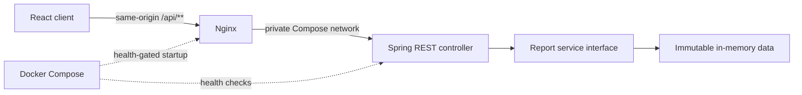

# Architecture and Design Decisions

## System overview

The portal is a small full-stack application with independently testable frontend, delivery, API, and data boundaries.



The browser receives static React assets from Nginx and sends API requests to the same origin. Nginx proxies `/api/**` requests to Spring Boot over the private Compose network. The controller delegates report retrieval to a service contract backed by deterministic immutable fixtures.

## Component boundaries

### Frontend

- **Pages** compose the reporting home and report-detail experiences.
- **Feature hooks** own request lifecycles, cancellation, retries, and state transitions.
- **API modules** perform HTTP requests, enforce timeouts, and validate response shapes.
- **Report definitions** map supported report IDs to endpoints, schemas, columns, and presentation metadata.
- **Shared components** render report cards, reusable states, and the semantic data table.

### Backend

- **Controllers** define the HTTP contract and JSON boundary.
- **Response records** represent immutable API payloads.
- **ReportService** separates transport concerns from data retrieval.
- **InMemoryReportService** supplies deterministic, thread-safe mock data.
- **Configuration** externalizes ports and the allowed CORS origins.

### Delivery

- **Nginx** serves the production frontend, provides SPA fallback routing, applies browser security headers, restricts methods, and proxies API traffic.
- **Docker Compose** builds both applications, waits for backend readiness, publishes loopback-only ports, and defines restart, logging, and shutdown behavior.
- **Health endpoints** make readiness observable to Compose and the verification script.

## API contract

All report operations are read-only and return JSON.

| Method | Path | Response |
| --- | --- | --- |
| `GET` | `/api/reports` | Report metadata with stable ID, description, update timestamp, and row count |
| `GET` | `/api/reports/users` | Users report rows |
| `GET` | `/api/reports/departments` | Departments report rows |
| `GET` | `/api/reports/projects` | Projects report rows |
| `GET` | `/actuator/health` | Application health status |

## Key design decisions

| Decision | Rationale | Tradeoff |
| --- | --- | --- |
| React, TypeScript, and Vite | Provides a fast client build, strict static checking, and a small runtime footprint. | Data-fetching conventions are maintained within the application rather than supplied by a larger framework. |
| Feature-oriented frontend structure | Keeps report API access, hooks, schemas, states, and presentation close to the feature they implement. | Introduces more directories than a three-page prototype strictly requires. |
| Typed report-definition registry | Allows one route and table renderer to support all reports while keeping columns, endpoints, and schemas explicit. | Adding a report requires a registry entry and a corresponding runtime guard. |
| Runtime response validation | Prevents malformed or incomplete API data from being silently rendered. | The frontend duplicates a small portion of the backend contract. |
| Purpose-built request hooks | Separates request lifecycle and recovery behavior from page rendering without adding a server-state dependency. | A larger application with caching and mutations would benefit from a dedicated server-state library. |
| Semantic tables with horizontal overflow | Preserves real header-cell relationships and every required business column on narrow screens. | Mobile users may need horizontal scrolling. |
| Client-side filtering and sorting | Delivers immediate interaction for small, bounded in-memory datasets. | Production-scale datasets should use server-side filtering, sorting, and pagination. |
| Spring Boot controller-service separation | Keeps the REST boundary independent of the current data implementation. | The service abstraction is more structure than an immutable fixture alone requires. |
| Immutable in-memory fixtures | Makes startup deterministic, concurrent reads safe, and database setup unnecessary. | Data is not persistent and update timestamps are fixed metadata. |
| ISO-8601 dates in the API | Avoids locale ambiguity and leaves presentation formatting to the client. | The frontend must format values for display. |
| Same-origin Nginx proxy | Gives production browser traffic one origin and avoids depending on permissive CORS behavior. | The proxy configuration must know the backend service address. |
| Allowlisted development CORS | Supports direct local development without allowing arbitrary browser origins. | Hosted environments must explicitly configure their frontend origin. |
| Multi-stage, digest-pinned images | Tests and static checks gate packaging while runtime images contain only necessary artifacts and resolve reproducibly. | Base-image upgrades require deliberate digest changes. |
| Health-gated startup | Prevents predictable frontend proxy failures while the backend is still starting. | A persistently unhealthy API prevents the frontend container from starting. |
| Non-root, loopback-only local deployment | Reduces container privileges and avoids unintended exposure to the local network. | Remote access requires an intentional ingress or bind-address change. |

## State model

Both report metadata and report rows use explicit states:

```text
idle/loading -> success
             -> empty
             -> error -> retry -> loading
```

Search can additionally produce a no-results state without changing the underlying successful response. Unknown report IDs are rejected by the client allowlist before an API request is constructed.

Requests are cancelled when their consuming component is replaced or unmounted. A 10-second timeout prevents an unavailable service from leaving the interface in an indefinite loading state.

## Reliability and security posture

- Report fixtures and Java response records are immutable.
- Controller tests cover every endpoint and accepted and rejected CORS preflights.
- Frontend component tests cover loading, empty, error, retry, filtering, sorting, malformed responses, routing, and navigation.
- Both containers run as non-root users and expose health checks.
- Compose includes dependency-aware startup, restart policies, signal-forwarding init processes, graceful stop windows, and bounded log rotation.
- Published ports bind to `127.0.0.1` for local-only access.
- Dynamic report identifiers are allowlisted before request construction.
- API strings are rendered through React and are never inserted as raw HTML.
- Nginx applies Content Security Policy, anti-framing, MIME-sniffing, referrer, and permissions controls.
- Spring error responses omit exception messages and stack traces.
- Actuator exposes only health and info, and health details are suppressed.

## Production evolution

The assessment intentionally implements a bounded local reporting slice. A production deployment would typically add:

- enterprise authentication and authorization at a trusted identity-aware gateway;
- TLS termination and managed ingress;
- repository-backed persistence with migrations;
- server-side query, filtering, sorting, and pagination;
- generated API schemas or clients;
- centralized metrics, logs, tracing, and alerting; and
- deployment automation for a selected hosting environment.

These concerns remain outside the current scope because adding simulated versions would increase complexity without improving the required reporting workflow.
