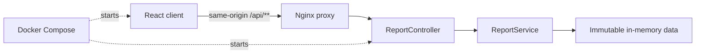

# Architecture

## Incremental delivery plan

The application is deliberately split at boundaries that can evolve independently:

- The controller owns HTTP routes and JSON serialization, not data creation.
- `ReportService` is the application boundary. The in-memory implementation can later be replaced by a repository-backed implementation without changing the API.
- Java records make response models concise and immutable.
- Configuration is externalized through environment variables so the same image can run locally or in a hosted environment.

## Phase 2 decisions

| Decision | Rationale | Tradeoff |
| --- | --- | --- |
| React 19, TypeScript, and Vite | A small, fast client build with strict static checks and no unnecessary framework runtime. | The application owns its data-fetching conventions rather than adopting a larger framework. |
| Feature-oriented frontend folders | API, hooks, page states, and report presentation evolve together without crowding global component folders. | A three-report application has more structure than strictly necessary today. |
| Same-origin API proxy | The browser talks only to the frontend origin in Compose, simplifying deployment and avoiding production CORS dependencies. | Nginx must know the backend service name. |
| Purpose-built `useReports` hook | Keeps request lifecycle, cancellation, retry, and UI rendering responsibilities separate. | A broader application could justify a server-state library once caching and mutations are needed. |
| Runtime response validation | Prevents malformed API payloads from silently corrupting the interface. | Hand-written guards must evolve with the API contract. |
| CSS design system without a UI kit | Creates a distinctive, lightweight interface while keeping full control of responsive and accessible behavior. | Common primitives must be maintained locally. |
| Route placeholder for report details | Report cards have stable, testable destinations while table work remains isolated to Phase 3. | This intermediate commit intentionally does not yet satisfy the final table-view requirement. |

## Phase 3 decisions

| Decision | Rationale | Tradeoff |
| --- | --- | --- |
| Typed report-definition registry | One route and table renderer support all reports while schemas, endpoints, columns, and presentation remain explicit. | Adding a report requires a registry entry and a row guard. |
| Report-specific runtime guards | A malformed row fails the request instead of producing a partially trusted or misleading table. | The client contract duplicates a small amount of backend schema knowledge. |
| Semantic table with horizontal overflow | Preserves real header/cell relationships and every required column at narrow widths. | Mobile users may scroll horizontally; hiding business data would be less transparent. |
| Client-side search and sorting | Immediate interactions are appropriate for the assessment's bounded in-memory datasets. | Production-scale datasets should move filtering, sorting, and pagination to the API. |
| Stable configured row keys | Prevents rendering instability and avoids treating row position as identity. | Unexpected rows fall back to an index-based key only after validation. |
| Unknown route allowlist | Only the three supported IDs can trigger requests, preventing arbitrary route text from becoming an API path. | Report availability is compiled into the client for this assessment. |

## Phase 4 decisions

| Decision | Rationale | Tradeoff |
| --- | --- | --- |
| Multi-stage images with build gates | Runtime images contain only the built application, while tests and static checks must pass before packaging. | Clean builds take longer than copying host artifacts. |
| Version tags plus immutable digests | Reviewers can understand the selected runtime versions while builds resolve to identical image content. | Intentional base-image upgrades require explicit digest changes. |
| Health-gated frontend startup | Nginx starts only after Spring Boot reports healthy, avoiding predictable startup-time proxy failures. | A persistently unhealthy backend prevents frontend startup rather than serving a degraded shell. |
| Loopback-only published ports | The local assessment is reachable by the reviewer without exposure to other machines on the network. | Remote access requires an intentional ingress or bind-address change. |
| Init and graceful stop windows | Signals are reaped/forwarded correctly and Spring has time to finish graceful shutdown. | Adds a tiny init process to each container. |
| Bounded JSON logs | Prevents an unattended local stack from consuming unlimited host disk. | Older logs rotate out after three 10 MB files per service. |
| Executable smoke-test script | Makes deployment assertions repeatable without adding a heavyweight end-to-end dependency. | Requires `curl`, available by default on common reviewer environments. |

## Phase 1 decisions

| Decision | Rationale | Tradeoff |
| --- | --- | --- |
| Spring Boot 3.5.x on Java 21 | A mature Spring generation plus an LTS JDK keeps reviewer setup predictable. | This intentionally favors compatibility over adopting Spring Boot 4 immediately. |
| Explicit report endpoints | Matches the assessment contract and keeps each response strongly typed. | Adding many report types would eventually benefit from a registry or generic query layer. |
| Immutable in-memory fixtures | Deterministic, thread-safe, and sufficient for the requested scope. | Changes disappear on restart and there is no persistence. |
| ISO-8601 dates and timestamps | Browser clients can parse them reliably without locale ambiguity. | Presentation formatting belongs to the frontend. |
| Allowlisted CORS origins | Supports local UI development without opening the API to every origin. | Deployment must provide its actual frontend origin. |
| No authentication in this slice | Authentication is outside the assessment requirements; inventing fake auth would not improve security. | A production internal portal should integrate with the organization's identity provider or gateway. |

## API contract

All endpoints return JSON and are read-only.

| Method | Path | Response |
| --- | --- | --- |
| `GET` | `/api/reports` | Report metadata with stable ID, description, update time, and row count |
| `GET` | `/api/reports/users` | User report rows |
| `GET` | `/api/reports/departments` | Department report rows |
| `GET` | `/api/reports/projects` | Project report rows |
| `GET` | `/actuator/health` | Container health status |

## Security and reliability posture

- Only configured browser origins can make cross-origin requests; only `GET` and preflight `OPTIONS` are allowed.
- Actuator exposure is limited to `health` and `info`, with health details suppressed.
- Default error responses do not disclose exception messages or stack traces.
- The container runs as a non-root user and uses graceful shutdown.
- Static data is immutable and safe for concurrent reads.
- Controller contract tests cover every endpoint and both accepted and rejected CORS preflights.
- Frontend requests are cancelled during unmount, time out after 10 seconds, validate response shape, and expose a retry action.
- Production browser traffic uses a same-origin proxy with CSP, anti-framing, MIME-sniffing, referrer, and permissions headers.
- Both runtime containers use non-root users and expose health checks to Compose.
- The frontend dependency lockfile currently reports zero known npm audit vulnerabilities.
- Dynamic report identifiers are allowlisted, and report rows must pass the matching runtime schema before rendering.
- Sorting and searching operate on validated, immutable response arrays and never generate HTML from API strings.
- Runtime images use non-root users, pinned bases, limited local exposure, bounded logs, init processes, and health checks.
- Nginx restricts methods, hides upstream server disclosure, and applies security headers without cache-directive inheritance gaps.

## Planned phases

1. **Backend foundation** - API, mock data, configuration, container, and tests.
2. **Reporting home** - responsive report discovery, search, routing, and loading/empty/error states.
3. **Report exploration** - responsive data tables for Users, Departments, and Projects with search, sorting, resilient states, and return navigation.
4. **Container delivery** - deterministic multi-stage images, health-gated orchestration, secure proxying, and repeatable smoke checks.
5. **Submission polish** - browser checks, accessibility and responsive QA, screenshots/demo, and final rubric review.
